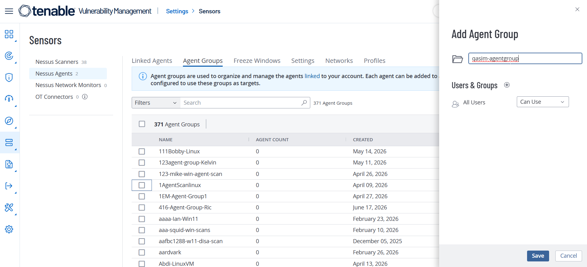
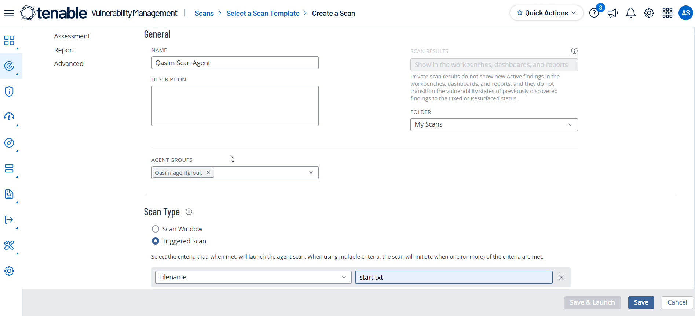
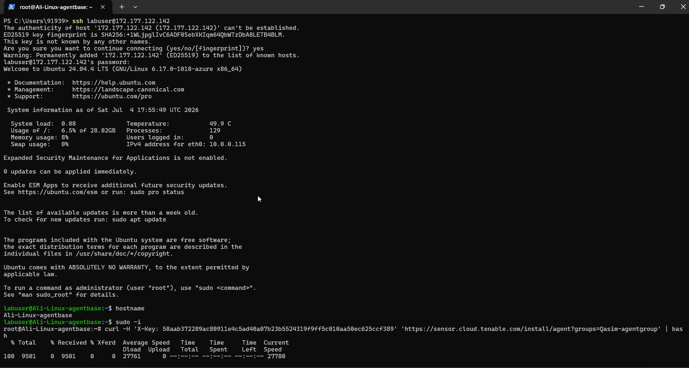
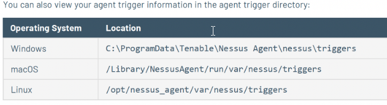
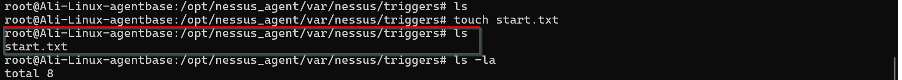
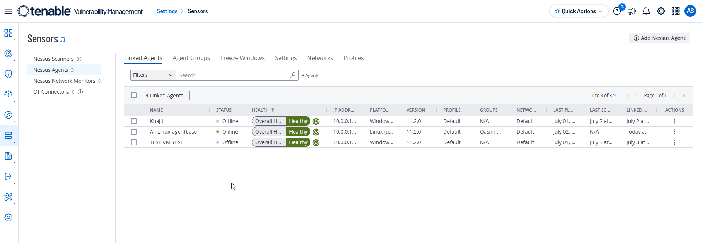
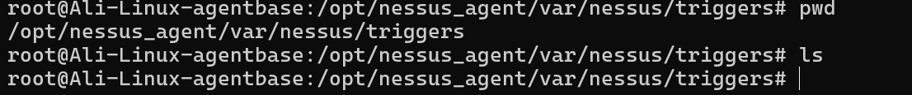
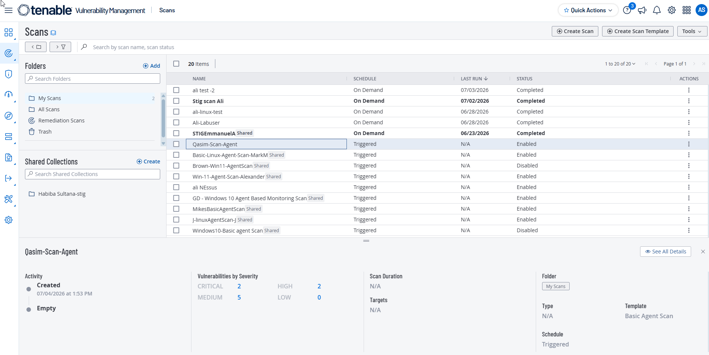

# Tenable Nessus Agent Triggered Scan on Linux

This project demonstrates how to deploy a **Tenable Nessus Agent** on a Linux virtual machine, link it to a Tenable Agent Group, configure a **Triggered Agent Scan**, and verify that the scan is successfully executed using a trigger file.

---

# Objective

The objective of this lab is to:

- Create a Linux Virtual Machine.
- Create a Tenable Agent Group.
- Configure a Triggered Nessus Agent Scan.
- Install and link a Nessus Agent to Tenable Cloud.
- Trigger a local scan using a file.
- Verify the scan execution from the Tenable Portal.

---

# Prerequisites

- Linux Virtual Machine (Ubuntu)
- Tenable Cloud Account
- Internet Connectivity
- Terminal access with sudo privileges

---

# Lab Environment

| Component | Value |
|-----------|-------|
| Platform | Ubuntu Linux |
| Scanner | Tenable Nessus Agent |
| Scan Type | Triggered Agent Scan |
| Portal | Tenable Cloud |

---

# Step 1 – Create the Linux Virtual Machine

Create and log in to your Linux Virtual Machine.

> **Figure 1:** Linux Virtual Machine



---

# Step 2 – Create an Agent Group

Navigate to:

```
Settings
    └── Sensors
            └── Nessus Agents
                    └── Agent Groups
                            └── Add Agent Group
```

Create a new Agent Group.

Example:

```
Qasim-agentgroup
```

Click **Save**.

> **Figure 2:** Creating a New Agent Group



---

# Step 3 – Create a Triggered Agent Scan

Navigate to:

```
Scans
    └── Create Scan
            └── Nessus Agent
                    └── Basic Agent Scan
```

Configure the scan as follows.

| Setting | Value |
|----------|-------|
| Agent Group | Your Agent Group |
| Scan Type | Triggered Scan |
| Trigger File | start.txt |

Save the scan.

> **Figure 3:** Triggered Agent Scan Configuration




---

# Step 4 – Download the Linux Installation Command

Navigate to:

```
Settings
    └── Sensors
            └── Nessus Agents
                    └── Linked Agents
                            └── Add Nessus Agent
```

Select **Linux** and copy the generated installation command.

Example:

```bash
curl -H 'X-Key: YOUR_API_KEY' 'https://sensor.cloud.tenable.com/install/agent?name=agent-name&groups=agent-group' | bash
```

> **Figure 4:** Linux Agent Installation Command



---

# Step 5 – Modify the Installation Command

Before executing the command:

- Remove the **name** parameter.
- Replace the **groups** parameter with the Agent Group you created.

Original command:

```bash
curl -H 'X-Key: YOUR_API_KEY' 'https://sensor.cloud.tenable.com/install/agent?name=agent-name&groups=agent-group' | bash
```

Modified command:

```bash
curl -H 'X-Key: YOUR_API_KEY' 'https://sensor.cloud.tenable.com/install/agent?groups=Qasim-agentgroup' | bash
```

> **Figure 5:** Modified Installation Command



---

# Step 6 – Install the Nessus Agent

Open the Linux Terminal and execute the modified command.

Example:

```bash
curl -H 'X-Key: YOUR_API_KEY' 'https://sensor.cloud.tenable.com/install/agent?groups=Qasim-agentgroup' | bash
```

Wait until the installation completes successfully.

> **Figure 6:** Nessus Agent Installation



---

# Step 7 – Create the Trigger File

Navigate to the trigger directory.

```bash
cd /opt/nessus_agent/var/nessus/triggers
```

Create the trigger file.

```bash
touch start.txt
```

This file name must match the trigger filename configured in the scan.

> **Figure 7:** Creating the Trigger File



---

# Step 8 – Monitor the Trigger File

Observe the directory.

```bash
ls
```

Once the Nessus Agent detects the trigger file, it automatically removes it.

The disappearance of the file indicates that the Triggered Agent Scan has started.

> **Figure 8:** Trigger File Removed



---

# Step 9 – Verify the Linked Agent

Return to the Tenable Cloud Portal.

Navigate to:

```
Settings
    └── Sensors
            └── Nessus Agents
```

Locate your newly linked agent.

Verify:

- Agent Name
- Agent Group
- Linked On Date
- Status

> **Figure 9:** Linked Nessus Agent


---

# Step 10 – Verify the Triggered Scan

Navigate to:

```
Scans
```

Open the Triggered Agent Scan you created.

Verify that:

- The Trigger File is listed as **start.txt**
- The scan has executed successfully.
- Results are available.

> **Figure 10:** Triggered Scan Results


---

# Verification

The lab is considered successful when:

- ✅ Nessus Agent is installed.
- ✅ Agent is linked to Tenable Cloud.
- ✅ Trigger file (`start.txt`) is detected.
- ✅ Trigger file disappears automatically.
- ✅ Triggered Agent Scan begins.
- ✅ Scan results are visible in the Tenable Portal.

---

# Commands Used

## Install Nessus Agent

```bash
curl -H 'X-Key: YOUR_API_KEY' 'https://sensor.cloud.tenable.com/install/agent?groups=YOUR_AGENT_GROUP' | bash
```

---

## Navigate to Trigger Directory

```bash
cd /opt/nessus_agent/var/nessus/triggers
```

---

## Create Trigger File

```bash
touch start.txt
```

---

## List Files

```bash
ls
```

---

# Conclusion

In this lab, a Tenable Nessus Agent was successfully installed on a Linux virtual machine and linked to a Tenable Agent Group. A Triggered Agent Scan was configured using a trigger file (`start.txt`). After creating the trigger file in the designated directory, the Nessus Agent detected and removed the file, initiating the scan automatically. The successful execution of the scan was verified through the Tenable Cloud Portal, demonstrating how Triggered Agent Scans can be used to perform on-demand vulnerability assessments without requiring scheduled scans.
